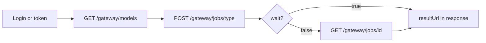

# Agent HTTP flow

Minimal **Mode B** loop for automation — no MCP required.

## Flow



## Script skeleton (PowerShell)

```powershell
$base = 'http://localhost:3001'
# 1. Token — login or $env:TOKEN
$h = @{ Authorization = "Bearer $env:TOKEN"; 'Content-Type' = 'application/json' }

# 2. Catalog
$models = Invoke-RestMethod "$base/gateway/models?type=image" -Headers @{ Authorization = "Bearer $env:TOKEN" }
$m = $models.data[0]
$slug = $m.model ?? $m.slug
$ratio = $m.ratios[0]
if ($ratio -is [pscustomobject]) { $ratio = $ratio.value }

# 3. Job
$job = Invoke-RestMethod -Method POST -Uri "$base/gateway/jobs/image" -Headers $h -Body (@{
  modelSlug = $slug; wait = $true
  fields = @{ prompt = 'A red apple'; ratio = $ratio }
} | ConvertTo-Json -Depth 5)

# 4. Output
$job.data.resultUrl
```

## Error handling

Gateway returns `{ "success": false, "message": "...", "code": "..." }` — agents should read `code` before retrying.

Common codes: `VALIDATION_ERROR`, `UNAUTHORIZED`, `UPSTREAM_ERROR`.

## MCP vs HTTP

Cursor **MCP tools** (`gommo_*`) are separate from this gateway. For production integrations use HTTP — see [MCP & agents](../mcp.md).

## Next

- [First image job](./image-job-wait.md)
- [Best practices](../best-practices/index.md)
