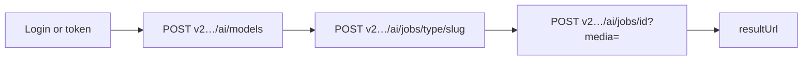

# Agent HTTP flow

Minimal loop for automation on the **Gommo public API** — no MCP or gateway required.

## Flow



## Script skeleton (PowerShell)

```powershell
$domain = if ($env:GOMMO_API_DOMAIN) { $env:GOMMO_API_DOMAIN } else { '79ai.net' }
$h = @{ Authorization = "Bearer $env:TOKEN"; 'Content-Type' = 'application/x-www-form-urlencoded' }

# 1. Catalog
$models = Invoke-RestMethod -Method POST `
  -Uri "https://v2.api.gommo.net/ai/models?type=image" `
  -Headers @{ Authorization = "Bearer $env:TOKEN" } `
  -ContentType "application/x-www-form-urlencoded" `
  -Body "type=image&domain=$domain"
$m = $models.data[0]
$slug = $m.model ?? $m.slug
$ratio = $m.ratios[0]
if ($ratio -is [pscustomobject]) { $ratio = $ratio.value }

# 2. Create job
$body = "domain=$domain&project_id=default&prompt=A red apple&ratio=$ratio"
$created = Invoke-RestMethod -Method POST `
  -Uri "https://v2.api.gommo.net/ai/jobs/image/$slug" `
  -Headers $h -Body $body
$jobId = $created.imageInfo.id_base ?? $created.data.id_base

# 3. Poll
$pollBody = "access_token=$env:TOKEN&domain=$domain"
for ($i = 1; $i -le 80; $i++) {
  $poll = Invoke-RestMethod -Method POST `
    -Uri "https://v2.api.gommo.net/ai/jobs/$jobId?media=image" `
    -Headers $h -Body $pollBody
  $url = $poll.imageInfo.result_url ?? $poll.data?.resultUrl
  if ($url) { $url; break }
  Start-Sleep -Seconds 3.5
}
```

## Error handling

Gommo returns upstream envelopes — agents should read `message` / status fields before retrying. Gateway Mode B adds `{ "success", "code" }` when you route through a self-hosted instance.

## MCP vs HTTP

Cursor **MCP tools** (`gommo_*`) are separate from HTTP. For production integrations use the public API — see [MCP & agents](../mcp/).

## Next

- [First image job](./image-job-wait.md)
- [Best practices](../best-practices/index.md)
