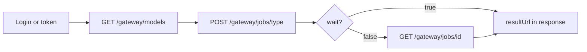

# Flow HTTP เอเจนต์

Loop **โหมด B** ขั้นต่ำสำหรับ automation — ไม่ต้องใช้ MCP

## Flow



## โครง script (PowerShell)

```powershell
$base = 'http://localhost:3001'
# 1. Token — login หรือ $env:TOKEN
$h = @{ Authorization = "Bearer $env:TOKEN"; 'Content-Type' = 'application/json' }

# 2. Catalog
$models = Invoke-RestMethod "$base/gateway/models?type=image" -Headers @{ Authorization = "Bearer $env:TOKEN" }
$m = $models.data[0]
$slug = $m.model ?? $m.slug
$ratio = $m.ratios[0]
if ($ratio -is [pscustomobject]) { $ratio = $ratio.value }

# 3. Job
$job = Invoke-RestMethod -Method POST -Uri "$base/gateway/jobs/image" -Headers $h -Body (@{
  modelSlug = $slug; wait = $true
  fields = @{ prompt = 'A red apple'; ratio = $ratio }
} | ConvertTo-Json -Depth 5)

# 4. Output
$job.data.resultUrl
```

## จัดการข้อผิดพลาด

Gateway คืน `{ "success": false, "message": "...", "code": "..." }` — agent ควรอ่าน `code` ก่อน retry

รหัสที่พบบ่อย: `VALIDATION_ERROR`, `UNAUTHORIZED`, `UPSTREAM_ERROR`

## MCP vs HTTP

**MCP tools** ของ Cursor (`gommo_*`) แยกจาก gateway นี้ สำหรับการเชื่อมต่อ production ใช้ HTTP — ดู [MCP & เอเจนต์](../mcp/)

## ถัดไป

- [งานรูปแรก](./image-job-wait.md)
- [แนวปฏิบัติที่ดี](../best-practices/index.md)
