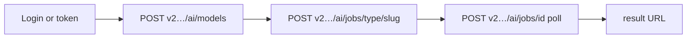

# Agent HTTP flow

Vòng lặp **Gommo public API** tối thiểu cho automation — không cần MCP.

## Flow



## Script skeleton (PowerShell)

```powershell
$d = if ($env:GOMMO_API_DOMAIN) { $env:GOMMO_API_DOMAIN } else { '79ai.net' }
$h = @{ Authorization = "Bearer $env:TOKEN" }

# 1. Catalog
$models = Invoke-RestMethod -Method POST `
  -Uri "https://v2.api.gommo.net/ai/models?type=image" `
  -Headers $h -ContentType "application/x-www-form-urlencoded" `
  -Body "type=image&domain=$d"
$m = $models.data[0]
$slug = $m.model ?? $m.slug
$ratio = $m.ratios[0]
if ($ratio -is [pscustomobject]) { $ratio = $ratio.value }

# 2. Create job
$job = Invoke-RestMethod -Method POST `
  -Uri "https://v2.api.gommo.net/ai/jobs/image/$slug" `
  -Headers $h -ContentType "application/x-www-form-urlencoded" `
  -Body "domain=$d&project_id=default&prompt=A red apple&ratio=$ratio"

# 3. Poll (simplified)
$jobId = $job.imageInfo.id_base
for ($i = 1; $i -le 80; $i++) {
  $poll = Invoke-RestMethod -Method POST `
    -Uri "https://v2.api.gommo.net/ai/jobs/$jobId?media=image" `
    -Headers $h -ContentType "application/x-www-form-urlencoded" `
    -Body "domain=$d&project_id=default"
  $url = $poll.imageInfo.result_url
  if ($url) { Write-Host $url; break }
  Start-Sleep -Seconds 3.5
}
```

## Xử lý lỗi

Gommo trả JSON với `success`, `message`, `error` — agents nên đọc trước khi retry.

## MCP vs HTTP

Cursor **MCP tools** (`gommo_*`) tách khỏi HTTP gateway. Production dùng HTTP public API — xem [MCP & agents](../mcp/).

## Tiếp theo

- [Image job đầu tiên](./image-job-wait.md)
- [Best practices](../best-practices/index.md)
